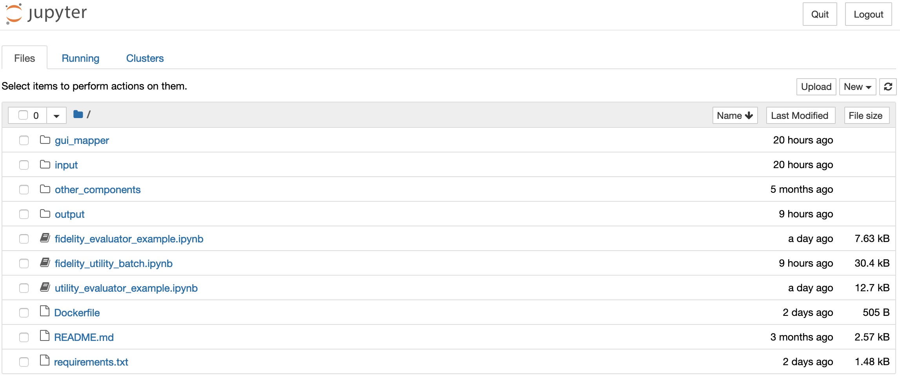
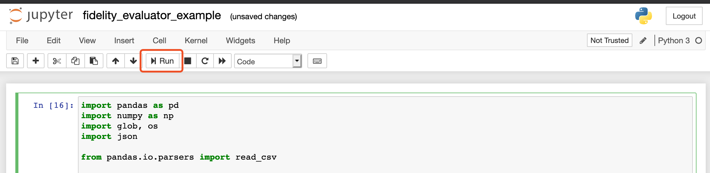
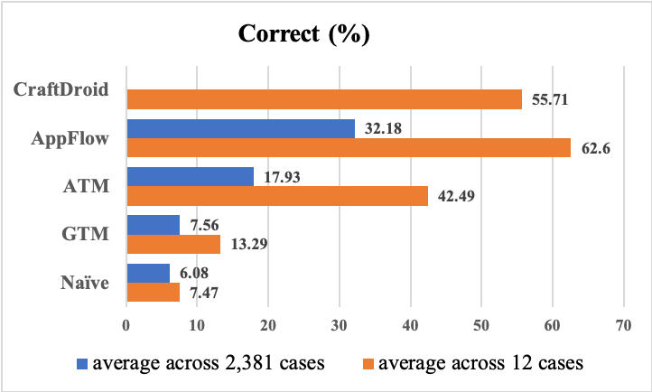
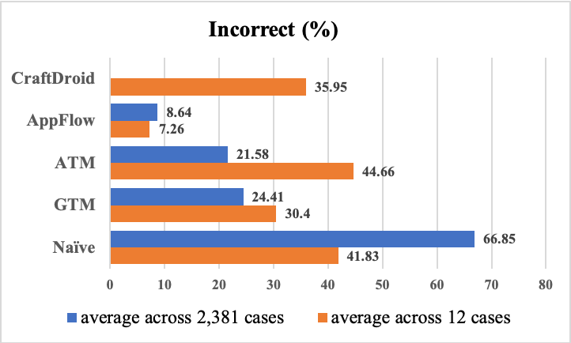
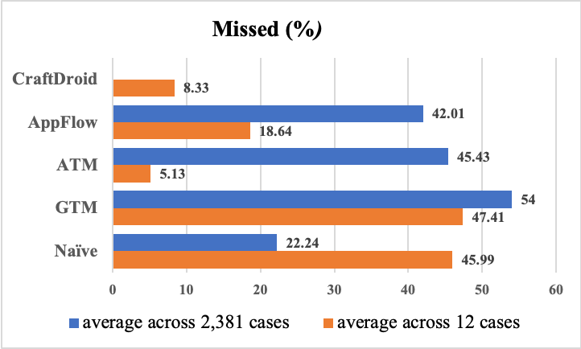
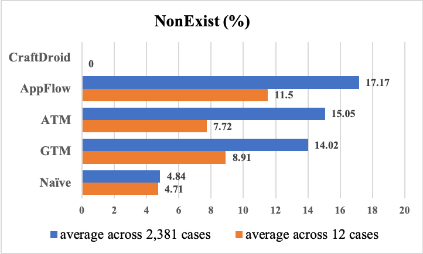

# Table of Content
<!--ts-->
   * [Table of Content](#table-of-content)
   * [FrUITeR's Introduction](#fruiters-introduction)
   * [Installation](#installation)
   * [Quick Start](#quick-start)
      * [Event Extractor](#event-extractor)
         * [Steps](#steps)
      * [Fidelity Evaluator and Utility Evaluator](#fidelity-evaluator-and-utility-evaluator)
         * [Steps](#steps-1)
   * [Fully Reproduce and Reuse](#fully-reproduce-and-reuse)
      * [Event Extractor](#event-extractor-1)
         * [Fully Reproduce Event Extractor](#fully-reproduce-event-extractor)
         * [Reuse Event Extractor](#reuse-event-extractor)
            * [Steps](#steps-2)
      * [Fidelity Evaluator and Utility Evaluator](#fidelity-evaluator-and-utility-evaluator-1)
         * [Fully Reproduce Fidelity Evaluator and Utility Evaluator](#fully-reproduce-fidelity-evaluator-and-utility-evaluator)
            * [Steps](#steps-3)
         * [Reuse Fidelity Evaluator and Utility Evaluator](#reuse-fidelity-evaluator-and-utility-evaluator)
            * [Steps](#steps-4)
   * [FrUITeR's Final Datasets](#fruiters-final-datasets)
      * [Header Description](#header-description)
      * [Results](#results)
   * [Guidance for New Techniques](#guidance-for-new-techniques)
      * [Prerequisite](#prerequisite)
      * [Steps](#steps-5)

<!-- Added by: yixue, at: Wed Sep  9 16:41:38 CDT 2020 -->

<!--te-->
<!-- run ./gh-md-toc --insert index.md to generate ToC automatically -->

# FrUITeR's Introduction

This document describes the artifacts associated with the paper **FrUITeR – A Framework for Evaluating UI Test Reuse** that has been accepted to **ESEC/FSE 2020**.

**Paper Authors:** Yixue Zhao, Justin Chen, Adriana Sejfia, Marcelo Schmitt Laser, Jie Zhang, Federica Sarro, Mark Harman, and Nenad Medvidovic.

**Paper Abstract:** UI testing is tedious and time-consuming due to the manual effort required. Recent research has explored opportunities for reusing existing UI tests for an app to automatically generate new tests for other apps. However, the evaluation of such techniques currently remains manual, unscalable, and unreproducible, which can waste effort and impede progress in this emerging area. We introduce FrUITeR, a framework that automatically evaluates UI test reuse in a reproducible way. We apply FrUITeR to existing test-reuse techniques on a uniform benchmark we established, resulting in all test reuse cases from 20 apps. We report several key findings aimed at improving UI test reuse that are missed by existing work.


**FrUITeR's Workflow:** As shown in the figure below, FrUITeR takes inputs from **Existing Tests** and **Existing Techniques** (left), and outputs the evaluation **Results** of given existing techniques in the end (right). The details of the workflow are described in Section 4.2 in the paper.

  

**Source Tests:** the test cases that need to be transferred.

**Ground-Truth Tests:** the manually constructed test cases that represent the ground truths for the transferred test cases.

**Transferred Tests:** the test cases transferred by a given test reuse technique (i.e., what we want to evaluate).

**Event Extractor:** FrUITeR's component that converts the test cases to a uniform format of event sequences, so that the heterogeneous test cases can be evaluated in the same way.

**Fidelity Evaluator:** FrUITeR's component that evaluates the *mapping* of the GUI events from the source app to the target app, based on FrUITeR's 7 fidelity metrics (recall Section 4.1.1 and Table 1 in the paper): (1) Correct;  (2) Incorrect; (3) NonExist; (4) Missed; (5) Accuracy; (6) Precision; and (7) Recall.

**GUI Maps:** the input for Fidelity Evaluator that contains the mapping of the GUI events from the source app to the target app generated by a given existing technique.

**Canonical Maps:** the input for Fidelity Evaluator that contains the manually constructed ground truths for the mapping of the GUI events from the source app to the target app.

**Utility Evaluator:** FrUITeR's component that evaluates the *usefulness* of test cases transferred by a given technique compared to the ground-truth test cases, based on FrUITeR's 2 utility metrics (recall Section 4.1.2 in the paper): (1) Effort; and (2) Reduction.

# Installation

1. Download and install **Docker Desktop**. \[[Link](https://www.docker.com/products/docker-desktop)\]

2. Start your Docker Desktop application and go to your favorite terminal. Test that your installation works by running the hello-world Docker image using command `$ docker run hello-world`. If you see the message below, Docker is successfully installed!
```
Unable to find image 'hello-world:latest' locally
    latest: Pulling from library/hello-world
    ca4f61b1923c: Pull complete
    Digest: sha256:ca0eeb6fb05351dfc8759c20733c91def84cb8007aa89a5bf606bc8b315b9fc7
    Status: Downloaded newer image for hello-world:latest

    Hello from Docker!
    This message shows that your installation appears to be working correctly.
    ...
```

**That's it! You're done with all the installation and ready to go! :D**

# Quick Start

FrUITeR has three components (shaded boxes in the workflow): (1) **Event Extractor**; (2) **Fidelity Evaluator**; and (3) **Utility Evaluator**. In the Quick Start section, we will run each of them with simple examples.

## Event Extractor

**Source Code Location:** [https://github.com/felicitia/EventExtractor](https://github.com/felicitia/EventExtractor)

Event Extractor is implemented in Java using [Soot framework](http://sable.github.io/soot/). We have created a Docker image with all the dependencies. Simply follow the steps below to run Event Extractor.

**What to Expect:** Let's use the app *Wish* as an example. Event Extractor will extract the GUI event sequences from Wish's test cases to `Wish.csv`. We assume the test cases are already written. For example, Wish's test cases are located on our Github repository: [Wish's test cases](https://github.com/felicitia/TestBenchmark-Jave-client/blob/master/src/main/java/Wish/RepresentativeTests.java).

### Steps

1. The Docker image of the Event Extractor is located on Docker Hub \[[Link](https://hub.docker.com/r/felicitia/fruiter-eventextractor)\]. In your favorite terminal, simply run the **CMD** below to download the Docker image to your local machine. (Make sure your Docker Desktop application is running.)

    **CMD**: `$ docker pull felicitia/fruiter-eventextractor`

2. We recommend creating a clean new directory for the output files produced by Event Extractor so that you can find them easily. For example, create a 'shared_volume' folder using the **CMD** below.

    **CMD**: `$ mkdir shared_volume`

3. Run Event Extractor to convert Wish's test cases into `Wish.csv` using the **CMD** below. You only need to replace `{ABSOLUTE_PATH}`, which is the full absolute path to the directory that contains the 'shared_volume' folder you just created in step 2. You can simply use `$ pwd` command to get the  absolute path of the current directory. If you want to know more about the Docker parameters, check out this [reference](https://thenewstack.io/docker-basics-how-to-share-data-between-a-docker-container-and-host/).

    **CMD**: `$ docker run -dit -P -v {ABSOLUTE_PATH}/shared_volume:/output/ felicitia/fruiter-eventextractor Wish.RepresentativeTests classes/ /output/`

4. You should see `Wish.csv` in the 'shared_volume' folder you created in step 2. You can compare yours with our example [Wish.csv](https://github.com/felicitia/EventExtractor/blob/master/example_output/Wish.csv) to check the correctness.

**If your `Wish.csv` looks the same as ours, congratulations! You have successfully run FrUITeR's Event Extractor!**

## Fidelity Evaluator and Utility Evaluator

**Source Code Location:** [https://github.com/felicitia/TestAnalyzer](https://github.com/felicitia/TestAnalyzer)

**Fidelity Evaluator** and **Utility Evaluator** are implemented in Python using [Jupyter Notebook](https://jupyter.org/). They belong to the **TestAnalyzer** repository. We envision Fidelity Evaluator and Utility Evaluator are two instances of TestAnalyzer's Evaluators based on the fidelity and utility metrics we defined. In the future, TestAnalyzer can be extended to include other Evaluators based on the metrics of one's interest (defined by us or other follow-up work).

We have created a Docker image with all the dependencies for you to launch Jupyter Notebook (no need to download Jupyter Notebook separately). Simply follow the steps below to run Fidelity Evaluator and Utility Evaluator.

**What to Expect:** Let's reproduce CraftDroid's 12 cases as an example (the 12 cases are described in Section 5.3.2 in the paper). Both Fidelity Evaluator and Utility Evaluator will output the final results of the 7 fidelity metrics and 2 utility metrics as `.csv` files, based on the necessary inputs indicated in the workflow diagram. 

### Steps

1. The Docker image of the TestAnalyzer (contains both Fidelity Evaluator and Utility Evaluator) is located on Docker Hub \[[Link](https://hub.docker.com/r/felicitia/fruiter-testanalyzer)\]. In your favorite terminal, simply run the **CMD** below to download the image to your local machine. (Make sure your Docker Desktop application is running.)

    **CMD**: `$ docker pull felicitia/fruiter-testanalyzer`

2. Run TestAnalyzer to launch the Jupyter Notebook server using the **CMD** below.

    **CMD**: `$ docker run -p 8888:8888 felicitia/fruiter-testanalyzer`

    You should see the following messages.
```
[I 02:44:42.811 NotebookApp] Writing notebook server cookie secret to /root/.local/share/jupyter/runtime/notebook_cookie_secret
[I 02:44:43.154 NotebookApp] Serving notebooks from local directory: /src
[I 02:44:43.154 NotebookApp] The Jupyter Notebook is running at:
[I 02:44:43.154 NotebookApp] http://b2ff46ae4b61:8888/?token=51aa6c478ed99cedcc04a22262c56d89952f4345bfd6f6ee
[I 02:44:43.154 NotebookApp]  or http://127.0.0.1:8888/?token=51aa6c478ed99cedcc04a22262c56d89952f4345bfd6f6ee
[I 02:44:43.154 NotebookApp] Use Control-C to stop this server and shut down all kernels (twice to skip confirmation).
[C 02:44:43.158 NotebookApp]

    To access the notebook, open this file in a browser:
        file:///root/.local/share/jupyter/runtime/nbserver-6-open.html
    Or copy and paste one of these URLs:
        http://b2ff46ae4b61:8888/?token=51aa6c478ed99cedcc04a22262c56d89952f4345bfd6f6ee
     or http://127.0.0.1:8888/?token=51aa6c478ed99cedcc04a22262c56d89952f4345bfd6f6ee
```

3. Copy the URL in the last line shown in step 2. In our example above, it is `http://127.0.0.1:8888/?token=51aa6c478ed99cedcc04a22262c56d89952f4345bfd6f6ee`. Open the URL in a browser. You should see a similar screen as below. (Make sure you don't have other Jupyter Notebook servers running already. You can use `$ jupyter notebook list` command as a sanity check.)

      

4. Go to `fidelity_evaluator_example.ipynb` and run it by clicking the 'Run' button as shown below. It will output `craftdroid_fidelity.csv` in the `output/` folder located in the home page (as indicated in the screenshot above). The output files can be downloaded to your local machine (download option is under the 'File' menu). You can compare your output with our example [craftdroid_fidelity.csv](https://github.com/felicitia/TestAnalyzer/blob/master/output/craftdroid_fidelity.csv) to check the correctness. Note that the order of the rows may be different depending on your local machine.

      

5. Similar to step 4, go to `utility_evaluator_example.ipynb` and run it by clicking the 'Run' button. It will output `craftdroid_utility.csv` in the `output/` folder located in the home page. You can compare your output with our example [craftdroid_utility.csv](https://github.com/felicitia/TestAnalyzer/blob/master/output/craftdroid_utility.csv) to check the correctness. Note that the order of the rows may be different depending on your local machine.

**If your `craftdroid_fidelity.csv` and `craftdroid_utility.csv` look the same as ours, congratulations! You have successfully run FrUITeR's Fidelity Evaluator and Utility Evaluator! You can now proceed to fully reproduce the results of all the test reuse cases from the 20 subject apps following the instructions below.**

# Fully Reproduce and Reuse

This section describes how to fully reproduce all the experiments (i.e., output the results of all the test reuse cases) studied in our ESEC/FSE 2020 paper. We will also explain how to reuse FrUITeR to run your own experiments.

## Event Extractor

### Fully Reproduce Event Extractor
The [Quick Start](#event-extractor) showed how to run Event Extractor using the app *Wish* as an example. Similarly, to fully reproduce Event Extractor with all the 20 subject apps, you can follow the same steps and simply replace the parameter `Wish.RepresentativeTests` in step 3 to another app `{APP_NAME}.RepresentativeTests`, such as `Etsy.RepresentativeTests` and `abc.RepresentativeTests`. The details of the 20 apps and their corresponding test cases are described in Table 2 and Table 3 in the paper.

The `{APP_NAME}` of our 20 subject apps can be found in Event Extractor's repository \[[Link](https://github.com/felicitia/EventExtractor/tree/master/src/main/jib/classes)\]. The corresponding `*.apk` files of the 20 apps can be downloaded [here](https://github.com/felicitia/TestBenchmark-Java-client/tree/master/subjects). You can compare your results of the 20 apps with ours [here](https://github.com/felicitia/TestAnalyzer/tree/master/input/extracted_tests).

### Reuse Event Extractor

If you wish to reuse FrUITeR's Event Extractor to extract the GUI event sequences from the test cases of your own choice, follow the steps below. Note that the current implementation of the Event Extractor is based on [Soot framework](http://sable.github.io/soot/), which only supports Java test cases. 

#### Steps

1. Clone the Event Extractor repository from Github \[[Link](https://github.com/felicitia/EventExtractor)\].

2. Obtain the `.class` files of your Java test cases. These `.class` files serve as the input to Event Extractor.

    If you have already written your Java test cases and compiled them, great! You will already have the `.class` files.

    If you wish to write new Java test cases from scratch, you can reuse our [TestBenchmark-Java-client](https://github.com/felicitia/TestBenchmark-Java-client) project by simply extending it. This is a [Maven](https://maven.apache.org/) project and the current test cases are written with [Appium framework](http://appium.io/). You can follow the same structure by adding test cases to `src/main/java/{APP_NAME}/{TEST_NAME}` and adding the subject app's `.apk` file to `subjects/{APP_CATEGORY}`. If your test cases are compiled successfully, the `.class` files will be generated, usually in `/target/classes/*`.

3. Copy `.class` files to Event Extractor project you cloned in step 1, under `src/main/jib/classes/*`.

**Final Remarks:** With your own `.class` files, you can run the Event Extractor on your own test cases now! Simply run the `main()` method in `src/main/java/EventExtractor` and specify the parameters (details of the parameters are explained as comments in the `src/main/java/EventExtractor.java`). If you also want to build a Docker image out of your own Event Extractor like FrUITeR, follow [this instruction](https://github.com/GoogleContainerTools/jib/tree/master/jib-maven-plugin) to  containerize your Maven project using Jib. 


## Fidelity Evaluator and Utility Evaluator

### Fully Reproduce Fidelity Evaluator and Utility Evaluator

**Friendly Reminder:** The experiments are executed *in batch* to produce the final results of all the test reuse cases (both fidelity and utility), based on the `.csv` files of the 20 apps produced after [fully reproducing the Event Extractor](#fully-reproduce-event-extractor). This batch process will take some time. The runtime may vary depending on the configuration of your local machine. In our experiment, each experiment took less than an hour. Our configuration is the following.
```
MacBook Pro (13-inch, 2019, Four Thunderbolt 3 ports)
Processor: 2.8 GHz Quad-Core Intel Core i7
Memory: 16 GB 2133 MHz LPDDR3
```

**What to Expect:** If successful, you will get `shopping_final.csv` that contains the results of the shopping apps, and `news_final.csv` that contains the results of the news apps.

#### Steps

1. Repeat the first 3 steps described in the [Quick Start](#steps-1) to launch the Jupyter Notebook and go to `fidelity_utility_batch.ipynb`.

2. Run the first cell to load all the functions. No output is expected.

3. Run the second cell to output intermediate results for the 10 **news apps**. This step takes time.

    **Expected Output:**

    ```
    Done 1/6 processing steps...
    Done 2/6 processing steps...
    Done 3/6 processing steps...
    Done 4/6 processing steps...
    Done 5/6 processing steps...
    Done 6/6 processing steps! :) Now writing intermediate results to framework_results_news.csv...
    All done! :D
    ```

4. Run the third cell to output intermediate results for the 10 **shopping apps**. This step takes time.

    **Expected Output:**

    ```
    Done 1/6 processing steps...
    Done 2/6 processing steps...
    Done 3/6 processing steps...
    Done 4/6 processing steps...
    Done 5/6 processing steps...
    Done 6/6 processing steps! :) Now writing intermediate results to framework_results_shopping.csv...
    All done! :D
    ```

5. Run the last cell to output final results. This step takes time. After you're done, you can find the final results in `/output/news_final.csv` and `/output/shopping_final.csv`, along with some intermediate results. You can compare your results with  [ours](https://github.com/felicitia/TestAnalyzer/tree/master/output) to check the correctness. Note that the order of the rows may be different depending on your local machine.

    **Expected Output:**

    ```
    Done 1/5 processing steps...
    Done 2/5 processing steps...
    Done 3/5 processing steps...
    Done 4/5 processing steps... Now writing news_final.csv to output folder
    Done 5/5 processing steps! :) Now writing shopping_final.csv to output folder
    All done! :D
    ```

### Reuse Fidelity Evaluator and Utility Evaluator

If you wish to reuse FrUITeR's Fidelity Evaluator and Utility Evaluator to analyze the test reuse cases of your own choice, or add your own Evaluator to calculate other metrics of interest, follow the steps below. 

#### Steps

1. Clone the TestAnalyzer repository (contains both Fidelity Evaluator and Utility Evaluator) from Github \[[Link](https://github.com/felicitia/TestAnalyzer)\].

2. Replace the `/input` folder with your own *GUI Maps* (GUI Map's definition is in Section 4.2 in the paper). Optionally, you can reuse/modify/extend the *ground-truths* specified in `/gui_mapper/ground_truth_mapping` folder to obtain the results based on your own ground truths.

3. If your *GUI Maps* and *ground truths* follow the same format as ours, you can run the Fidelity Evaluator and Utility Evaluator in the same way (that you already did!) to get the final results. Otherwise, modify our Fidelity Evaluator and Utility Evaluator or add your own Evaluators to evaluate other interesting metrics of your own choice!

**Final Remarks:** If you also want to build a Docker image out of your own Evaluators like FrUITeR, follow [this instruction](https://u.group/thinking/how-to-put-jupyter-notebooks-in-a-dockerfile/) to containerize your own Jupyter Notebook project. 


# FrUITeR's Final Datasets

The results reported in the paper are based on the final datasets \[[Datasets.zip](https://figshare.com/articles/Datasets/12425246)\]. They are processed by the R scripts included in `Datasets.zip` based on the `news_final.csv` and `shopping_final.csv` after [fully reproducing the Fidelity Evaluator and Utility Evaluator](#fully-reproduce-fidelity-evaluator-and-utility-evaluator). The details of the final datasets are described in Section 5.3.2 in the paper. 

**`Datasets.zip` Content:** The final datasets are stored as `final_dataset.RData`. The R scripts used to process and analyze the final datasets are located in `/scripts`. If you are unable to view `.RData` file, the same final datasets are exported as two `.csv` files.

- `final_2381.csv` contains the data of the 2,381 cases
- `final_12.csv` contains the data of the 12 cases

## Header Description

The meaning of the headers in the final datasets are explained in the table below.

|     Header Name    | Description                                                                                 |
|:------------------:|---------------------------------------------------------------------------------------------|
|       `source`       | source app                                                                                  |
|       `target`       | target app                                                                                  |
|       `method`       | test case being transferred                                                                 |
|     `gui_mapper`     | the GUI Mapper used to transfer the test                                                    |
|     `src_events`     | source events in the source test                                                            |
|    `trans_events`    | transferred events in the transferred test                                                  |
|      `gt_events`     | ground-truth events in the ground-truth test                                                |
|       `num_src`      | the number of source events                                                                 |
|      `num_trans`     | the number of transferred events                                                            |
|       `num_gt`       | the number of ground-truth events                                                           |
|       `correct`      | the set of *correct* events                                                                 |
|      `incorrect`     | the set of *incorrect* events                                                               |
|       `missed`       | the set of *missed* events                                                                  |
|      `nonExist`      | the set of *nonExist* events                                                                |
|     `num_correct`    | the number of the *correct* events                                                          |
|    `num_incorrect`   | the number of the *incorrect* events                                                        |
|     `num_missed`     | the number of the *missed* events                                                           |
|    `num_nonExist`    | the number of the *nonExist* events                                                         |
|   `percent_correct`  | FrUITeR's fidelity metric: the percentage of the *correct* events                           |
|  `percent_incorrect` | FrUITeR's fidelity metric: the percentage of the *incorrect* events                         |
|   `percent_missed`   | FrUITeR's fidelity metric: the percentage of the *missed* events                            |
|  `percent_nonExist`  | FrUITeR's fidelity metric: the percentage of the *nonExist* events                          |
| `accuracy_precision` | FrUITeR's fidelity metric: the value of the *precision*                                     |
|   `accuracy_recall`  | FrUITeR's fidelity metric: the value of the *recall*                                        |
|      `accuracy`      | FrUITeR's fidelity metric: the value of the *accuracy*                                      |
|      `distance`      | FrUITeR's utility metric: *effort* needed to correct the transferred test                   |
|      `reduction`     | FrUITeR's utility metric: manual effort *reduction* compared to writing the test from scratch |

## Results

Our paper describes FrUITeR's 7 fidelity metrics and 2 utility metrics. Due to space limitations, we show the results of 3 fidelity metrics and 2 utility metrics in the paper. The rest of the results can be found below.









# Guidance for New Techniques

As explained in the paper, certain information needs to be provided to enable FrUITeR’s automated workflow discussed in Section 4.2. Specifically, the needed information is as follows. 

1. the Source Tests that are supplied as inputs to a given test-reuse technique
2. the Transferred Tests and GUI Maps, which are produced as outputs of a given test-reuse technique
3. the manually constructed ground truths, namely, Canonical Maps and Ground-Truth Tests

Since existing test-reuse techniques were proposed before FrUITeR and were not designed with FrUITeR’s workflow in mind, we had to modify existing techniques to obtain such information. This step will not be necessary for new techniques if following our guidance. This section describes the steps needed to use FrUITeR to evaluate a new test-reuse technique. Let’s get started! :)

## Prerequisite

We assume you have already followed our [Installation](#installation) and [Quick Start](#quick-start). If not, please follow those steps first to get your Docker environment ready!

## Steps

You’ll need to provide several artifacts produced by your fancy technique, following the format that FrUITeR supports. Then you can run FrUITeR as you did in the [Quick Start](#quick-start) to get the fidelity and utility results of your technique automatically! The specific steps are provided below.

1. Extract the GUI events from your Source Tests. The extracted events should follow the format below as a `.csv` file. If your tests are written in Java using Appium, you can reuse FrUITeR’s [Event Extractor](#event-extractor). 

   | method                                     | event_array                    |
   | :----------------------------------------- | ------------------------------ |
   | <App1.ClassName_of_Tests: void testName()> | [ {GUI_Event1}, {GUI_Event2} ] |

   **event_array** column contains a JSON array of **GUI Events** that belong to a certain test specified in the **method** column. Each **GUI Event** is a JSON object with the following fields. 

   ```
   {
     "input": "XXX", //the input value associated with the event (if any)
     "id_or_xpath": "XXX", //the resource id (starting with "id@") or xpath (starting with "xpath@")
     "action": "XXX" //the action of the event, e.g., "sendKeys", "click"
   }
   ```

   **Example:**  Source Tests of Etsy can be found [here](https://github.com/felicitia/TestBenchmark-Java-client/blob/master/src/main/java/Etsy/RepresentativeTests.java). In this case, your extracted GUI events will look like this file [etsy.csv](https://github.com/felicitia/TestAnalyzer/blob/master/input/extracted_tests/shopping/etsy.csv).

2. Use your technique to generate the mapping results (i.e., Transferred Tests produced by your technique) following FrUITeR’s format (same format as the `.csv` file from step 1). But note that **event_array** contains the GUI events of the **Transferred** Tests, while in step 1 it contains the GUI events of the **Source** Tests. 

   Optionally, if you want to separate the results of oracle events from the regular events, you can generate the mapping results of the oracle events following the same workflow to obtain their fidelity and utility results separately. Alternatively, you can include additional fields to the GUI Event object to capture the event type (e.g., oracle events) and extend FrUITeR's Fidelity Evaluator and Utility Evaluator to separate the results of different types of events.

   **Example:** The mapping results of transferring Etsy’s *sign-in* and *sign-up* tests to Wish’s may look like this file [etsy_wish.csv](https://github.com/felicitia/TestAnalyzer/blob/master/input/craftdroid/mapping_results/etsy_wish.csv). Note that we added a filed “score” to the GUI Event object that captures the raw similarity score. You can add a field “event_type” to capture oracle events as mentioned above, or other fileds of interest.

3. Manually construct Canonical Maps for each of your subject app. You can reuse, modify, or extend [FrUITeR’s Canonical Maps](https://github.com/felicitia/TestAnalyzer/tree/master/input/ground_truth_mapping) if using the same subject apps. 

   **Example:** Etsy’s Canonical Map may look like this file [GT_etsy.csv](https://github.com/felicitia/TestAnalyzer/blob/master/input/ground_truth_mapping/shopping/GT_etsy.csv). The required fields are (1) at least one of **id** and **xpath** fields has to be specified; (2) **canonical** that shows the Canonical Event that the app-specific event maps to; (3) only if you are using our Naive baseline, **current Activity** and **next Activity** need to be specified. If the next Activity is the same as the current Activity, you can leave it empty.

4. Extract the GUI events from your Ground-Truth Tests. This is essentially the same step as step 1 and you can reuse step 1’s artifacts. For example, the extracted GUI events of Etsy will be Source Events if Etsy is the source app, and will be the Ground-Truth Events is Etsy is the target app. 

5. Extract the UI layout dumps, i.e., `.uix` files in XML format dumped by [Android’s UIAutomator](https://developer.android.com/training/testing/ui-automator). This is used to identify the same  event if it’s specified in different ways (i.e., either id or xpath). For example, if an event `Event1` in the Transfered Test uses `xpath` but the Canonical Map uses `id`  to specify `Event1`, we will not be able to find the Canonical Event of  `Event1` directly. In this case, FrUITeR analyzes the UI layout dumps (i.e., the `.uix` files) to identify the XML element of `Event1` based on its xpath. With the information in the identified XML element, FrUITeR will be able to find the `id`  (specified in `resource-id` field) of `Event1` and will be able to find its Canonical Event accordingly based on that `id`.

   **Example:** Some examples of Etsy’s UI layout dumps can be found in [this folder](https://github.com/felicitia/TestAnalyzer/tree/master/input/screenshots/shopping/etsy). The screenshot `.png` files are not necessary, but just to give an intuitive understanding of what each UI layout dump is. 

   Congratulations! 👏 Now you have prepared all the needed inputs for FrUITeR. We assume you have already run FrUITeR successfully following the [Quick Start](#quick-start). Now you can just replace FrUITeR’s default inputs with yours and rerun FrUITeR to get the results of your new shiny technique. Hope your new technique outperforms the state-of-the-art! 😉
