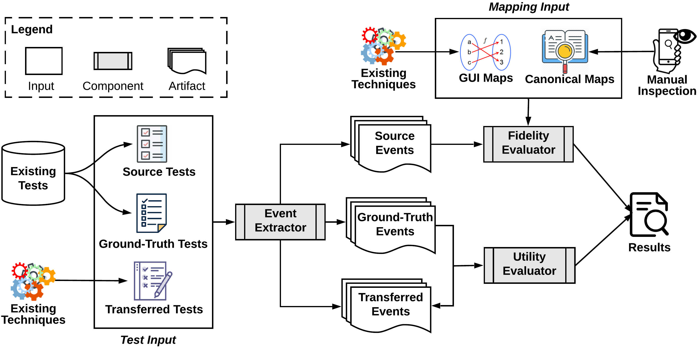

<!--ts-->
  * [FrUITeR's Introduction](#fruiters-introduction)
  * [Artifact Dolownload](#artifact-dolownload)
  * [FrUITeR's Components and Baseline](#fruiters-components-and-baseline)
     * [Components](#components)
     * [Baseline](#baseline)
  * [Modularization of Existing Techniques](#modularization-of-existing-techniques)
     * [Extracted GUI Mappers](#extracted-gui-mappers)
     * [Unified GUI Maps and Transferred Tests](#unified-gui-maps-and-transferred-tests)
  * [FrUITeR's Benchmark](#fruiters-benchmark)
  * [FrUITeR's Final Datasets](#fruiters-final-datasets)
     * [Header Description](#header-description)
  * [FrUITeR's Data Analyses](#fruiters-data-analyses)
<!--te-->

# FrUITeR's Introduction

**Paper Abstract:** UI testing is tedious and time-consuming due to the manual effort required. Recent research has explored opportunities for reusing existing UI tests for an app to automatically generate new tests for other apps. However, the evaluation of such techniques currently remains manual, unscalable, and unreproducible, which can waste effort and impede progress in this emerging area. We introduce FrUITeR, a framework that automatically evaluates UI test reuse in a reproducible way. We apply FrUITeR to existing test-reuse techniques on a uniform benchmark we established, resulting in 11,917 test reuse cases from 20 apps. We report several key findings aimed at improving UI test reuse that are missed by existing work.


**FrUITeR's Workflow:** As shown in the figure below, FrUITeR takes inputs from Existing Tests and Existing Techniques (left), and outputs the evaluation Results of a given existing technique in the end (right). 

  

**Source Tests:** the test cases that need to be transferred.

**Ground-Truth Tests:** the manually constructed test cases that represent the ground truths for the transferred test cases.

**Transferred Tests:** the test cases transferred by a given test reuse technique (i.e., what we want to evaluate).

**Event Extractor:** FrUITeR's component that converts the test cases to a uniform format of event sequences, so that the heterogenous test cases can be evaluated in the same way.

**Fidelity Evaluator:** FrUITeR's component that evaluates the *mapping* of the GUI events from the source app to the target app, based on FrUITeR's 7 fidelity metrics: (1) accuracy; (2) precision; (3) recall; (4) correct;  (5) incorrect; (6) nonExist; and (7) missed.

**GUI Maps:** the input for Fidelity Evaluator that contains the mapping of the GUI events from the source app to the target app generated by a given existing technique.

**Canonical Maps:** the input for Fidelity Evaluator that contains the manually constructed ground truths for the mapping of the GUI events from the source app to the target app.

**Utility Evaluator:** FrUITeR's component that evaluates the *usefulness* of test cases transferred by a given technique compared to the ground-truth test cases, based on FrUITeR's 2 utility metrics: (1) effort; and (2) reduction.

# Installation
1. Download and install **Docker Desktop** from this link ([https://www.docker.com/products/docker-desktop](https://www.docker.com/products/docker-desktop))

2. Start your docker application and open the terminal. Test that your installation works by running the hello-world Docker image using command `$ docker run hello-world`. If you see the message below, Docker is successfully installed!
```
Unable to find image 'hello-world:latest' locally
    latest: Pulling from library/hello-world
    ca4f61b1923c: Pull complete
    Digest: sha256:ca0eeb6fb05351dfc8759c20733c91def84cb8007aa89a5bf606bc8b315b9fc7
    Status: Downloaded newer image for hello-world:latest

    Hello from Docker!
    This message shows that your installation appears to be working correctly.
    ...
```

3. That's it! You're done with all the installation and ready to go! :)

# Quick Start

FrUITeR has three components (shaded boxes in the workflow): (1) **Event Extractor**; (2) **Fidelity Evaluator**; and (3) **Utility Evaluator**. We will now run each of them with a simple example.

## How to Run Event Extractor

Event Extractor is implemented in Java using [Soot framework](https://github.com/Sable/soot). The source code is located on Github: https://github.com/felicitia/EventExtractor. We have created a Docker image with all the dependencies. Simply follow the steps below to run Event Extractor.

**What to Expect:** Let's use the app *Wish* as an example. Event Extractor will extract the GUI event sequences from Wish's test cases written in Java to `Wish.csv`. We assume the test cases are already written. For example, Wish's test cases are located on our Github reposotiry: [Wish's test cases](https://github.com/felicitia/TestBenchmark-Jave-client/blob/master/src/main/java/Wish/RepresentativeTests.java).

### Steps:

1. The Docker image of the Event Extractor is located on Docker Hub ([repo link](https://hub.docker.com/r/felicitia/fruiter-eventextractor)). In your favorite terminal, simply run the CMD below to download the image to your local machine. (Make sure your Docker Desktop application is running.)

    CMD: `$ docker pull felicitia/fruiter-eventextractor`

2. We recommend creating a clean new directory for the output files produced by Event Extractor so that you can find them easily. For example, create a 'shared_volume' folder using the CMD below.

    CMD: `$ mkdir shared_volume`

3. Run Event Extractor to convert Wish's test cases into `Wish.csv` using the CMD below. `{absolute path}` is the absolute path to the directory that contains the 'shared_volume' folder you just created in step 2. If you want to know more about the parameters, check out this [reference](https://thenewstack.io/docker-basics-how-to-share-data-between-a-docker-container-and-host/).

    CMD: `$ docker run -dit -P -v {absolute path}/shared_volume:/output/ felicitia/fruiter-eventextractor Wish.RepresentativeTests classes/ /output/`

4. You should see `Wish.csv` in the 'shared_volume' folder you created in step 2. You can compare yours with our example [Wish.csv](https://github.com/felicitia/EventExtractor/blob/master/example_output/Wish.csv) to make sure it's correct.

## How to Run Fidelity Evaluator and Utility Evaluator

**Fidelity Evaluator** and **Utility Evaluator** are implemented in Python using [Jupyter Notebook](https://jupyter.org/). The source code is located on Github within TestAnalyzer project: https://github.com/felicitia/TestAnalyzer. We envision Fidelity Evaluator and Utility Evaluator are two instances of TestAnalyzer's Evaluators based on the fidelity and utility metrics we defined. In the future, TestAnalyzer can be extended to include other Evaluators based on the metrics of one's interest (defined by us or other follow-up work).

We have created a Docker image with all the dependencies for you to launch Jupyter Notebook. Simply follow the steps below to run Fidelity Evaluator and Utility Evaluator.

**What to Expect:** Let's reproduce CraftDroid's 12 cases as an example (the 12 cases are described in Section 5.3.2 Final Datasets). Both Fidelity Evaluator and Utility Evaluator will output the final results based on 7 fedelity metrics and 2 utility metrics as `.csv` files, based on the necessary inputs indicated in the workflow diagram.

### Steps:

1. The Docker image of the TestAnalyzer (that contains Fidelity Evaluator and Utility Evaluator) is located on Docker Hub ([repo link](https://hub.docker.com/r/felicitia/fruiter-testanalyzer)). In your favorite terminal, simply run the CMD below to download the image to your local machine. (Make sure your Docker Desktop application is running.)

    CMD: `$ docker pull felicitia/fruiter-testanalyzer`

2. Run TestAnalyzer to launch the Jupyter Notebook server using the CMD below.

    CMD: `docker run -p 8888:8888 felicitia/fruiter-testanalyzer`

    You should see the following messages.
```
[I 02:44:42.811 NotebookApp] Writing notebook server cookie secret to /root/.local/share/jupyter/runtime/notebook_cookie_secret
[I 02:44:43.154 NotebookApp] Serving notebooks from local directory: /src
[I 02:44:43.154 NotebookApp] The Jupyter Notebook is running at:
[I 02:44:43.154 NotebookApp] http://b2ff46ae4b61:8888/?token=51aa6c478ed99cedcc04a22262c56d89952f4345bfd6f6ee
[I 02:44:43.154 NotebookApp]  or http://127.0.0.1:8888/?token=51aa6c478ed99cedcc04a22262c56d89952f4345bfd6f6ee
[I 02:44:43.154 NotebookApp] Use Control-C to stop this server and shut down all kernels (twice to skip confirmation).
[C 02:44:43.158 NotebookApp]

    To access the notebook, open this file in a browser:
        file:///root/.local/share/jupyter/runtime/nbserver-6-open.html
    Or copy and paste one of these URLs:
        http://b2ff46ae4b61:8888/?token=51aa6c478ed99cedcc04a22262c56d89952f4345bfd6f6ee
     or http://127.0.0.1:8888/?token=51aa6c478ed99cedcc04a22262c56d89952f4345bfd6f6ee
```

3. Copy the URL in the last line shown in step 2. In our example output above, it is `http://127.0.0.1:8888/?token=51aa6c478ed99cedcc04a22262c56d89952f4345bfd6f6ee`. Open the URL in a broswer. You should see a similar screen as below.

  

4. Go to `fidelity_evaluator_example.ipynb` and run it by clicking the 'Run' button as shown below. It will output `craftdroid_fidelity.csv` in the `output/` folder located in the home page (as indicated in the screenshot above). The output files can be downloaded to your local machine (download option is under the 'File' menu). You can compare your output with our example [craftdroid_fidelity.csv](https://github.com/felicitia/TestAnalyzer/blob/master/output/craftdroid_fidelity.csv) to make sure it's correct. The fidelity metrics are shown in the right-most columns.

  

5. Similar to step 4, go to `utility_evaluator_example.ipynb` and run it by clicking the 'Run' button. It will output `craftdroid_utility.csv` in the `output/` folder located in the home page. You can compare your output with our example [craftdroid_utility.csv](https://github.com/felicitia/TestAnalyzer/blob/master/output/craftdroid_utility.csv) to make sure it's correct. The utility metrics are shown in the right-most columns.

# Fully Reproduce

### Baseline

FrUITeR’s baseline techniques **Naïve** and **Perfect** are implemented in Python.

`Location:` Repo #2 `TestAnalyzer/gui_mapper/baseline/`


## Modularization of Existing Techniques

To modularize existing techniques, we (1) extracted their [GUI Mappers](#extracted-gui-mappers), and (2) unified their [GUI Maps and Transferred Tests](#unified-gui-maps-and-transferred-tests).

### Extracted GUI Mappers

The GUI Mapper components extracted from existing techniques are implemented in their original programing languages. 

**AppFlow's GUI Mapper** is implemented in Python. (1,084 SLOC). 

`Location:` Repo #3 `AppFlowGUIMapper/elements.py`

**ATM's GUI Mapper** is in Java (1,314 SLOC). 

`Location:` Repo #4 `ATMGUIMapper/src/`

**GTM's GUI Mapper** is implemented in Java (1,409 SLOC).

`Location:` Repo #5 `GTMGUIMapper/src/`

As explained in the paper (Section 5.1), we did not implement **CraftDroid's GUI Mapper**, but can only interpret its published artifacts [[link]](https://sites.google.com/view/craftdroid/); that functionality is implemented in Python (86 SLOC). 

`Location:` Repo #2 `TestAnalyzer/gui_mapper/craftdroid/`


### Unified GUI Maps and Transferred Tests

The functionality that processes the GUI Mappers' outputs and generates the uniform representation of *GUI Maps* and *Transferred Tests* (recall FrUITeR's workflow) is implemented in Python (404 SLOC). 

`Location:` Repo #2 `TestAnalyzer/gui_mapper/{technique_name}`  
*Note: GTM reused `TestAnalyzer/gui_mapper/atm`*

The processed **GUI Maps** and **Transferred Tests** are stored as `.csv` files.

`Location:` Repo #6 `GUIMaps/{technique_name}`

## FrUITeR's Benchmark

1. Benchmark Apps are located in Repo #7 `TestBenchmark/subjects/`
2. Benchmark Tests are located in Repo #7 `TestBenchmark/src/`
3. Benchmark *Canonical Maps* are located in Repo #2 `TestAnalyzer/gui_mapper/ground_truth_mapping/`

## FrUITeR's Final Datasets

Final Datasets are located in Repo #8 `DataAnalysis/FSE2020-dataset.RData`

If you are unable to view `.RData` file, the same final datasets are exported as two `.csv` files.
1. Repo #8 `DataAnalysis/final_2381.csv` contains the data of the 2,381 cases
2. Repo #8 `DataAnalysis/final_12.csv` contains the data of the 12 cases

### Header Description

|     Header Name    | Description                                                                                 |
|:------------------:|---------------------------------------------------------------------------------------------|
|       `source`       | source app                                                                                  |
|       `target`       | target app                                                                                  |
|       `method`       | test case being transferred                                                                 |
|     `gui_mapper`     | the GUI Mapper used to transfer the test                                                    |
|     `src_events`     | source events in the source test                                                            |
|    `trans_events`    | transferred events in the transferred test                                                  |
|      `gt_events`     | ground-truth events in the ground-truth test                                                |
|       `num_src`      | the number of source events                                                                 |
|      `num_trans`     | the number of transferred events                                                            |
|       `num_gt`       | the number of ground-truth events                                                           |
|       `correct`      | the set of *correct* events                                                                 |
|      `incorrect`     | the set of *incorrect* events                                                               |
|       `missed`       | the set of *missed* events                                                                  |
|      `nonExist`      | the set of *nonExist* events                                                                |
|     `num_correct`    | the number of the *correct* events                                                          |
|    `num_incorrect`   | the number of the *incorrect* events                                                        |
|     `num_missed`     | the number of the *missed* events                                                           |
|    `num_nonExist`    | the number of the *nonExist* events                                                         |
|   `percent_correct`  | FrUITeR's fidelity metric: the percentage of the *correct* events                           |
|  `percent_incorrect` | FrUITeR's fidelity metric: the percentage of the *incorrect* events                         |
|   `percent_missed`   | FrUITeR's fidelity metric: the percentage of the *missed* events                            |
|  `percent_nonExist`  | FrUITeR's fidelity metric: the percentage of the *nonExist* events                          |
| `accuracy_precision` | FrUITeR's fidelity metric: the value of the *precision*                                     |
|   `accuracy_recall`  | FrUITeR's fidelity metric: the value of the *recall*                                        |
|      `accuracy`      | FrUITeR's fidelity metric: the value of the *accuracy*                                      |
|      `distance`      | FrUITeR's utility metric: *effort* needed to correct the transferred test                   |
|      `reduction`     | FrUITeR's utility metric: manual effort *reduction* compared to writing the test from scratch |


## FrUITeR's Data Analyses

The data analyses that interpret our final datasets are written in R (585 SLOC).

`Location:` Repo #8 `DataAnalysis/scripts/`
